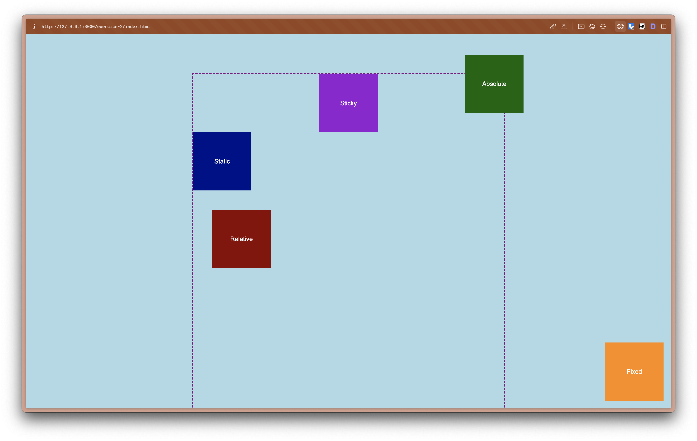

# Exercice 2

Jouez avec les positions css pour obtenir le résultat suivant:

## Instructions

allez dans le fichier style.css et suivez les instructions en commentaires pour compléter les propriétés css afin d'obtenir le résultat attendu.
